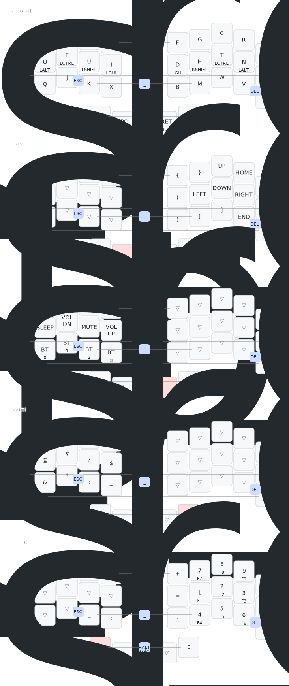

# ZMK config

This is a ZMK config for a Ferry Sweep keyboard (34-keys) built using Nice!Nano v2 micro-controllers.

The base layer is based on the DVORAK layout with home row mods (GACS) and a bunch of combos setup to easy access to important keys. Three other layers can be accessed from the base, providing quick access to the numerical, navigation and symbols layers.

More details can be seen in the map below or in the `cradio.keymap` file.

