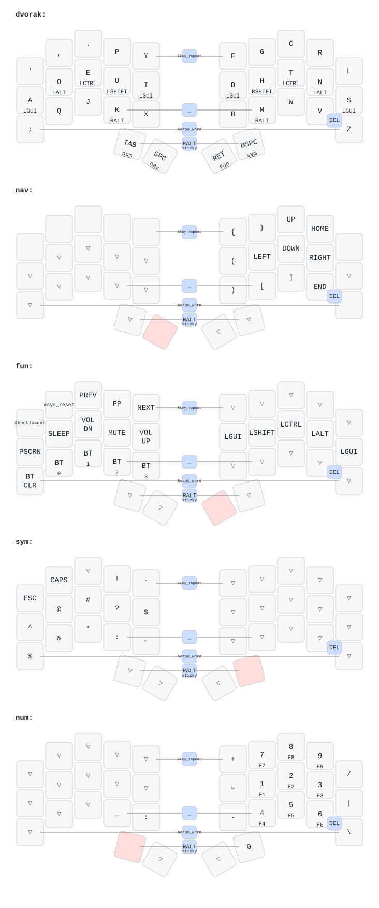

# ZMK config

This is a ZMK config for a Ferris Sweep keyboard (34-keys) built using Nice!Nano v2 micro-controllers.

The base layer is based on the DVORAK layout with home row mods (GACS) and a bunch of combos setup to easy access to important keys. Three other layers can be accessed from the base, providing quick access to the numerical, navigation and symbols layers.

More details can be seen in the map below or in the `cradio.keymap` file.



## Building locally

Requires Docker.

**First-time setup** — clones ZMK and initializes the west workspace (takes a few minutes):

```bash
python build.py setup
```

**Build firmware:**

```bash
python build.py build
python build.py build --pristine  # clean build
```

**Flash** — for keymap changes, only the left (central) half needs to be reflashed.

Enter bootloader mode via the keymap: hold the right thumb key (FUN layer) and press the top-left key (`&bootloader`). The LED pattern changes to confirm bootloader mode.

The keyboard shows up as `/dev/sdb` but doesn't auto-mount. Mount it manually:

```bash
sudo mount -o uid=1000,gid=985 /dev/sdb /media/kb
python build.py flash left
```

The drive unmounts itself automatically once flashing is done.
